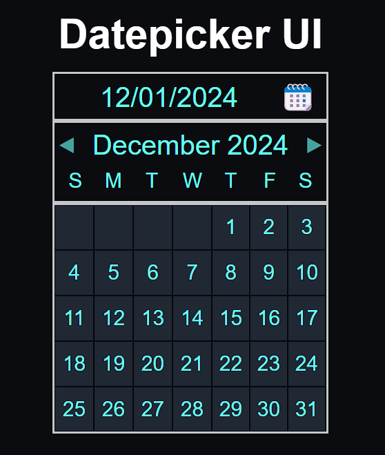

# Datepicker UI

## HTML and CSS Datepicker

## Description
- This project was built with html and css only
- The motivation behind this project was to create something that will help scheduling your life
- This will help the prevention of procrastination and get done what must be done
- While building this project I sharppend my CSS grid skills

## Usage
- Click hte link to head to the Project Repository https://github.com/0mar77/datepicker-ui
- Clone the repository
- Launch in local environment

## Project URL

https://roadmap.sh/projects/datepicker-ui